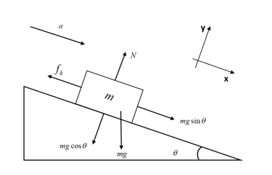
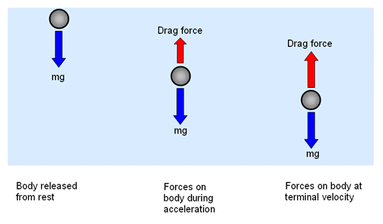

# Week 1 - Notes: Introduction to Classical Mechanics

## How do we formulate Classical Mechanics?

In the past, you have learned about [Newton's Laws of Motion](https://en.wikipedia.org/wiki/Newton%27s_laws_of_motion). These laws are the foundation of classical mechanics. They are used to describe the motion of objects in the universe. In this course, we will use these laws to describe the motion of particles and rigid bodies. As we progress, we will learn other formulations of classical mechanics, such as the [Lagrangian](https://en.wikipedia.org/wiki/Lagrangian_mechanics) and [Hamiltonian](https://en.wikipedia.org/wiki/Hamiltonian_mechanics) reformulations.

Newton's Laws of Motion are a vector formulation of classical mechanics. The laws are as follows:
1. **First Law**: An object at rest will remain at rest, and an object in motion will remain in motion at a constant velocity unless acted upon by an external force.
2. **Second Law**: The acceleration of an object is directly proportional to the net force acting on it and inversely proportional to its mass. The direction of the acceleration is in the direction of the net force.
3. **Third Law**: For every action, there is an equal and opposite reaction.

These are the classic laws of motion that you have learned in other courses. How we formulate these laws mathematically is the subject of this course.

## Newton's Second Law

[Newton's Second Law](https://en.wikipedia.org/wiki/Newton%27s_laws_of_motion#Newton's_second_law) provides the mathematical foundation for classical mechanics. It provides a vector relationship between the net force acting on an object and its acceleration. The law is given by the equation:

$$\vec{F}_{net} = m\vec{a}$$

where $\vec{F}_{net}$ is the net force acting on the object, $m$ is the mass of the object, and $\vec{a}$ is the acceleration of the object. This equation is a vector equation, meaning that it must be satisfied in each direction. 

$$\begin{aligned}
F_{net,x} &= m a_x \\
F_{net,y} &= m a_y \\
F_{net,z} &= m a_z
\end{aligned}$$

Each push in a Cartesian direction results in a proportional response -- an acceleration in the same direction of the net push. Let's go through a common example to illustrate this relationship.

### Example: A Block on an Inclined Ramp

Consider the box (mass, $m$) above on an inclined ramp (angle, $\theta$). The box is at rest subject to static friction, $\mu_s$. _What angle of inclination will cause the box to start sliding down the ramp?_

We start by drawing the [Free Body Diagram](https://en.wikipedia.org/wiki/Free_body_diagram) (FBD) of the box. 

<br>
[Source: homework.study.com](images/notes/week1/diagram_2_450x3002352212273710292.png)

The FBD is a diagram that shows all the forces acting on the object. In this case, the forces acting on the box are:
- The force of gravity, $mg$, acting downwards.
- The force due to the ramp, which is both perpendicular to the ramp surface (normal) and parallel to it (friction).

We tilt our coordinate system to align with the ramp. This makes the normal force, $N$, act in the $y$-direction and the frictional force, $f$, act in the $x$-direction. The force of gravity is split into two components: $mg\sin(\theta)$ and $mg\cos(\theta)$.

The net force acting on the box is the sum of the forces acting on it, and is zero up to the point where the box starts sliding. At this point, the frictional force is at its maximum value, $\mu_s N$. Taking the sum of the forces acting on the box in each direction we have:

$$\vec{F}_{net} = \vec{f} + \vec{N} + \vec{F}_{gravity} = 0$$

$$\sum F_{x,i} = f - mg\sin(\theta) = 0$$
$$\sum F_{y,i} = N - mg\cos(\theta) = 0$$

Thus, 

$$f = mg\sin(\theta)$$
$$N = mg\cos(\theta)$$

At the point where the box starts sliding, the frictional force is at its maximum value, $\mu_s N$. Thus, the box starts sliding when:

$$f = \mu_s N$$

Substituting the expressions for $f$ and $N$ into the equation above, we have:

$$mg\sin(\theta) = \mu_s mg\cos(\theta)$$

Solving for $\theta$:

$$\tan(\theta) = \mu_s$$
$$\theta = \tan^{-1}(\mu_s)$$

Thus, the box starts sliding when the angle of inclination is equal to the arctangent of the coefficient of static friction. 

```{admonition} Check
We can check this with some numbers. Steel as a static friction coefficient of about 0.16, and rubber is closer to 0.8. Thus, the angle of inclinations for steel and rubber are:

$$\theta_{steel} = \tan^{-1}(0.16) \approx 9^\circ$$
$$\theta_{rubber} = \tan^{-1}(0.8) \approx 39^\circ$$

It seems quite reasonable that rubber would have a higher angle of inclination before sliding than steel.
```
```{tip}
A few things to note about this problem:
1. This was a static problem, such that $\vec{F}_{net} = 0$.
2. We rotated our coordinate system to align with the ramp. This is a common technique in classical mechanics to simplify the problem.
3. We still used Cartesian coordinates to solve the problem. This is because the forces could be easily decomposed in the titled coordinate system.
```

Let's work an example that is dynamic, where the net force is not zero.

### Example: Falling Object in One Dimension

Consider an object of mass $m$ falling, but it is subject to air resistance. The free body diagram of the object shows that the forces acting on the object are:
- The force of gravity/weight, $W=mg$, acting downwards.
- The force due to air resistance, $F_{air}$, acting upwards.

<br>
[Source: ibphysicsguide.weebly.com](images/notes/week1/570899611.gif)

Here we have chosen positive $y$ to be the downward direction. We want to predict the motion ($a$, $v$, $y$) of the object as a function of time. This is a very common problem for classical mechanics.

#### Air Drag?

First, we notice that we do not know the force due to [air resistance](https://en.wikipedia.org/wiki/Drag_(physics)). We do know that the force is related to the velocity of the object. So let's start by writing the air resistance force as a function of velocity:

$$F_{air} = F(v)$$

where $F(v)$ is some function of velocity. 

#### Taylor Series Expansion

Because we know that the objects move slowly in classical mechanics, we can assume that the function can be expanded using a [Taylor Series](https://en.wikipedia.org/wiki/Taylor_series).  In general, the Taylor Series of a function $f(x)$ about a point $a$ is given by:

$$f(x) = \sum_{n=0}^{\infty} \frac{f^{(n)}(a)}{n!}(x-a)^n$$

where $f^{(n)}(a)$ is the $n$-th derivative of $f(x)$ evaluated at $x=a$. We can write the first few terms out,

$$f(x) = f(a) + f'(a)(x-a) + \frac{f''(a)}{2!}(x-a)^2 + \frac{f'''(a)}{3!}(x-a)^3 + \ldots$$

Because we know that the object is moving slowly, we can expand the function $F(v)$ about $v=0$:

$$F(v) = F(0) + F'(0)v + \frac{F''(0)}{2!}v^2 + \ldots$$

We can assume that the first term is zero, $F(0)=0$, because there is no air resistance when the object is at rest. Thus, the force due to air resistance is approximately:

$$F(v) \approx F'(0)v + \frac{F''(0)}{2!}v^2$$

We call the first term the **linear drag** term and the second term the **quadratic drag** term. The linear drag term is proportional to the velocity of the object, and the quadratic drag term is proportional to the square of the velocity of the object. We also typically replace the evaluated derivatives with constants, $b$ and $c$ -- because they are constants that depend on the object and the fluid it is moving through. And thus,

$$F_{air} \approx bv + cv^2$$


#### Back to Newton's Second Law

In the $y$-direction, the net force acting on the object is:

$$F_y = W - F_{air} = mg - bv - cv^2$$

And thus, the acceleration of the object is:

$$a = g - \frac{b}{m}v - \frac{c}{m}v^2$$

This [differential equation]((https://en.wikipedia.org/wiki/Differential_equation)) can be written in a variety of ways. One common way is to write the equation as a [second-order differential equation](https://math.libretexts.org/Bookshelves/Differential_Equations/Introduction_to_Partial_Differential_Equations_(Herman)/12:_B_-_Ordinary_Differential_Equations_Review/12.02:_Second_Order_Linear_Differential_Equations). 

$$\frac{d^2y}{dt^2} = g - \frac{b}{m}\frac{dy}{dt} - \frac{c}{m}\left(\frac{dy}{dt}\right)^2$$

Note that this is a nonlinear differential equation (i.e., there's a $(d^ny/dt^n)^m$ term where $m > 1$), which are notoriously difficult to solve in general. We can write it using the dot notation for derivatives (i.e., $\dot{y} = dy/dt$, $\ddot{y} = d^2y/dt^2$):

$$\ddot{y} = g - \frac{b}{m}\dot{y} - \frac{c}{m}\dot{y}^2$$

We can also use the velocity as the independent variable, $v = \dot{y}$. Both equations below are equivalent:

$$\frac{dv}{dt} = g - \frac{b}{m}v - \frac{c}{m}v^2$$
$$\dot{v} = g - \frac{b}{m}v - \frac{c}{m}v^2$$

```{tip}
A few things to note:
1. This is a dynamic one-dimensional problem, such that $\vec{F}_{net} \neq 0$.
2. This is a nonlinear problem, such that the acceleration is a function of the velocity of the object.
3. We are stuck with a differential equation that we need to solve, and don't have a simple algebraic solution (e.g., a simple antiderivative).
```

**How do we solve this equation to find the motion of the object as a function of time?**  We will come back to this, but solving differential equations is the primary tool of classical mechanics. We will learn how to solve these equations analytically and numerically in this course.


